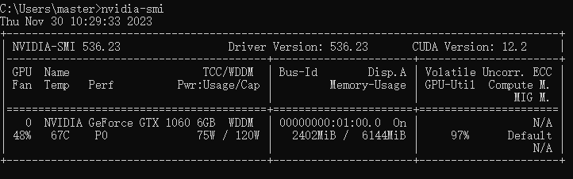
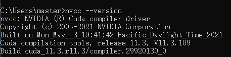
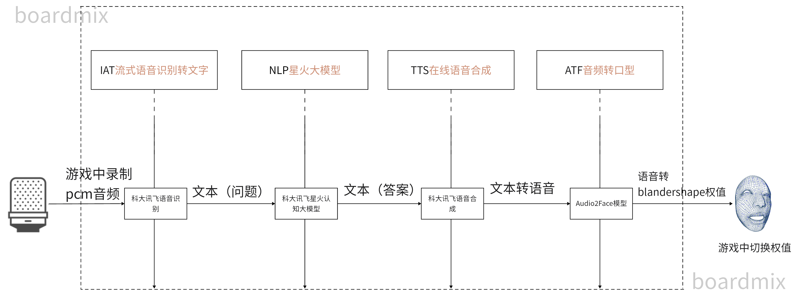

<style>
p{
text-indent: 2em;
}
</style>

<font size = 6><b><center>🤗Plusbe数字人方案Pipeline V0.1🤗</center></b></font>

---
<font size = 4><center>前言</center></font>

<p>该pipeline仅用于3D模型数字人的口型显示，输入为一段wav格式音频，最终输出为一段包含模型blandershape的权值点的txt文件。最终在程序中的权值点调用应另外编写代码。</p>

* 使用语言 python3
* 使用环境 Windows
* 使用深度学习框架 tensorflow-gpu==2.6.0，CUDA 11.3.1 ，cudatoolkit 11.3.1，cudnn 8.2.1，scipy 1.7.1

----

[toc]

# 💻环境配置

><mark>注意，以下命令都需要在虚拟环境中执行</mark>

1. 💡<font size = 4 color = red>配置虚拟环境：</font>
首先需要一个用于调用整个pipeline的conda虚拟环境，下载Anaconda并安装。python版本使用3.7~3.9。

* 启动`AnacondaPrompt`,创建虚拟环境`conda create -n your_env_name python=3.9`
* CD到该目录，使用`pip install -r requirements.txt` 指令安装所需的所有依赖包。
* 使用`pip install -r requirements.txt` 指令安装所需的所有依赖包。

2. 💡<font size = 4 color = red>安装CUDA：</font>
CUDA是深度学习必备的硬件支持

* 在`CMD`中使用`nvidia-smi`命令检查显卡算力以及可支持最高CUDA版本，CUDA是向下兼容的，只要当前显示CUDA可用版本大于11.3即可<center></center>
* 使用`pip install cudatoolkit==11.3.1` 指令安装cudatoolkit
* 在[NVIDIA官网](https://developer.nvidia.com/cuda-11-3-1-download-archive)下载CUDA 11.3.1并安装。
* 安装[cuDNN](https://developer.nvidia.com/rdp/cudnn-download)8.2.1
* 在`CMD`中使用`nvcc --version`命令检查CUDA是否安装成功，显示如下图像证明安装成功<center></center>

3. 💡<font size = 4 color = red>修改.bat文件：</font>
打开[run.bat](./run.bat)文件以调用[main.py](./main.py)文件并执行整个pipeline，在此之前需要修改以下环境中[run.bat](./run.bat)文件的设置：

```bash
CALL {你的conda安装路径下的 \anaconda3\Scripts\activate.bat路径} {\anaconda3的路径}
CALL conda activate {你创建的虚拟环境名称}
python main.py
```

4. <font size = 4 color = red>修改config.json文件：</font>[config.json](./config.json)中保存了调用模型的APIkey等信息以及不同阶段调用API的POST请求设置，请根据需要并参考官方文档进行修改：

* Step1-IAT：[流式语音识别转文字](https://www.xfyun.cn/doc/asr/voicedictation/API.html)
* Step2-NLP：[星火大模型V3.0](https://www.xfyun.cn/doc/spark/Web.html)
* Step3-TTS：[在线语音合成](https://www.xfyun.cn/doc/tts/online_tts/API.html)
* Step4-ATF：[音频转口型](https://github.com/FACEGOOD/FACEGOOD-Audio2Face)

5. <font size = 4 color = red>在程序中调用.bat文件：</font>

在程序中录制一段`wav`格式音频，并在音频文件保存完成后定义一个事件回调以调用[run.bat](./run.bat)文件

6. <font size = 4 color = red>查看日志：</font>
在每一步生成后都会留下对应的日志，请根据需要查看。

# ⚙️调用流程

在程序中调用该pipeline的基本流程应该为：

```
程序录制wav音频完成并触发事件回调，调用run.bat文件
{pipeline调用}
获取返回的blandershape的txt权值文件并通知程序中调用权值
```

通过事件通知保证三个步骤间的耦合度尽可能低，以便于pipeline在不同代码和环境下的复用。

```
目前初设使用UDP向9008端口发送接收命令，当程序接收到命令后对文件进行处理。
后续考虑使用TCP长连接流式传输字节流。
```

## pipeline工作流

整个pipeline被分为了四步，每一步我们都放在了对应的模块当中。并由[main.py](./main.py)来对各个模块进行整体调度。这方便我们将pipeline按照步骤依次进行，并可随时修改各个模块。

整个pipeline工作流如下图所示：



其中虚线框部分代表了整个pipeline的工作流，每个模块都是独立可替换的。

# 📖更新日志

此单元汇总了所有版本中解决或未解决的问题，将在此后不同版本逐步优化：

* 目前Pipeline中信息的传递方式是另存为一个文件并作为下一步流水线的输入。应当修改为比特流的传递。
* 讯飞的IAT，NLP，TTS的ws返回值响应都是支持流式传输的，完善返回值响应。
* 使用多线程实现高效的口型权值转换。
* 暂不支持NLP模型的上下文输入，有待完善。
* 模型的权值点过少，只能实现口型变化，ATF模型支持整个面部表情的权值训练，使用面部捕捉收集数据集。
* TTS模块可以使用开源项目[so-vits-svc](https://github.com/svc-develop-team/so-vits-svc)训练自己的声音模型
* 使用UDP通知程序处理，开关socket的过程太耗时，用一个线程开启TCP长连接并实现数据的流式传输或者直接根据窗口获取句柄调用事件更好。

## V0.1

* 整合Pipeline，使用bat进行简单调用

---

# 贡献者

<table>
    <tr>
        <td align="center">
            <a href="https://github.com/ELK-milu">
                
                <br>
                <sub>
                    <b>ELK-milu</b>
                </sub>
            </a>
        </td>
    </tr>
</table>
